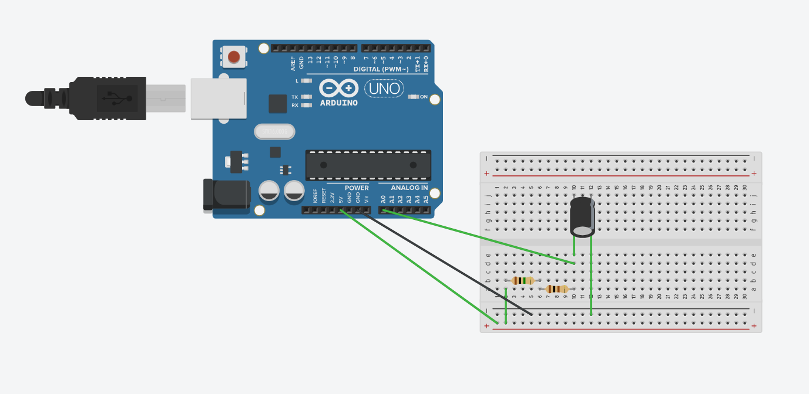
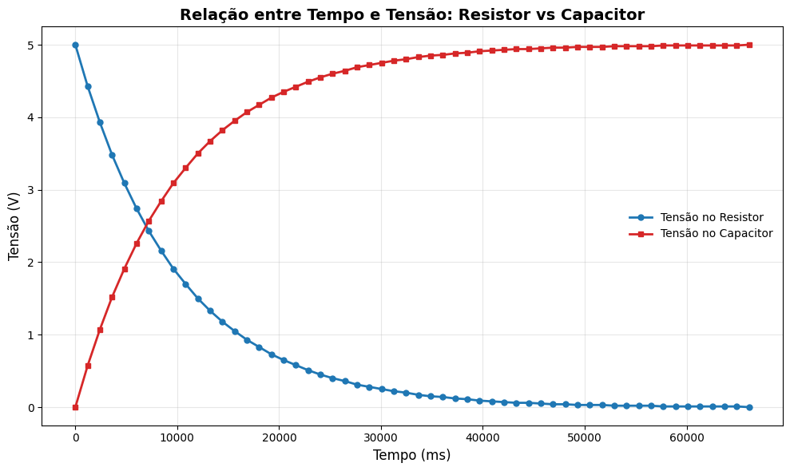

# Circuito RC

Este repositório foi criado para documentar e entregar a atividade ponderada referente ao estudo de um circuito RC (Resistor-Capacitor), analisando seu processo de carga e descarga.

## Objetivo

O objetivo deste projeto é montar um protótipo de um circuito RC simples, utilizar o Arduino para coletar dados de tensão no capacitor ao longo do tempo e, por fim, plotar um gráfico que demonstre a curva de carga do capacitor.

---

## Protótipo (Circuito)

A montagem do circuito foi realizada na plataforma Tinkercad. O circuito é composto por um Arduino Uno, um resistor, um capacitor e jumpers.



---
## Gráfico da Curva de Carga

O gráfico demonstra visualmente o comportamento da carga do capacitor, ao longo do tempo.



---

## Código Utilizado

O código abaixo foi carregado no Arduino. Sua função é alimentar o circuito RC e, simultaneamente, ler a tensão no capacitor através de uma porta analógica (A0). Os dados de Tempo (ms) e Tensão (V) são enviados para o Monitor Serial.

```c
int pinoNoRC=0; 
int valorLido = 0;
float tensaoCapacitor = 0, tensaoResistor;
unsigned long time; 
void setup(){ 
Serial.begin(9600); 
} 
void loop() { 
	time=millis(); 
	valorLido=analogRead(pinoNoRC); 
	tensaoResistor=(valorLido*5.0/1023); // 5.0V / 1023 degraus = 0.0048876 
	tensaoCapacitor = abs(5.0-tensaoResistor);
 	Serial.print(time); //imprime o conteúdo de time no MONITOR SERIAL
    Serial.print(" "); 
  	Serial.print(tensaoResistor);
  	Serial.print(" ");
  	Serial.println(tensaoCapacitor); 
	delay(400); 
}

